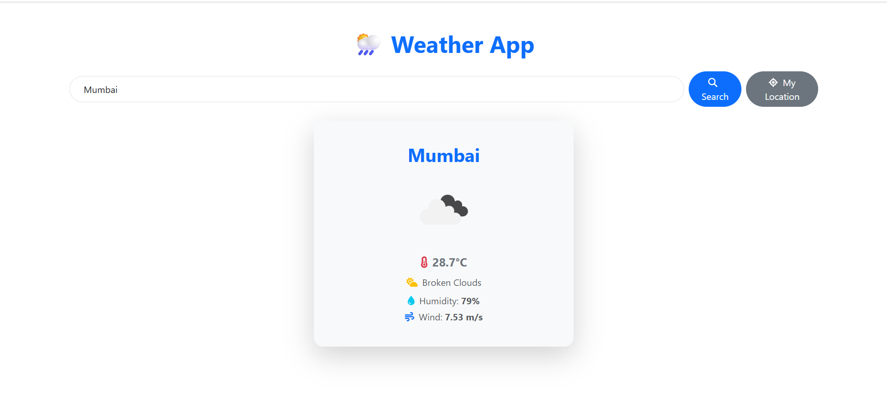

# 🌦️ Weather App

A beautifully designed weather application built with **React.js (Vite)** and **React Bootstrap** that displays current weather based on **user location** or **searched city**. It fetches real-time data from the **OpenWeatherMap API**, uses modern animations, and ensures a smooth user experience.

---

## 🚀 Features

- 🔍 Search weather by city name
- 📍 Auto-fetch current weather using geolocation
- 📡 Real-time data from OpenWeatherMap
- 🎨 Modern UI with weather icons & background
- ⚡ Fast performance using Vite
- 📱 Fully responsive & mobile-friendly
- 💨 Animated components with Framer Motion
- 🔐 Secure API key via `.env`

---

## 🖥️ Tech Stack

- React.js (Vite)
- React Bootstrap
- Framer Motion
- Font Awesome
- OpenWeatherMap API

---

## 📷 Screenshot



---

## 📂 Project Structure

```
src/
├── components/           # WeatherCard & WeatherForm
├── services/             # API logic (weatherService.js)
├── App.jsx               # Main application
├── main.jsx              # Entry point
├── App.css               # Custom styles
└── .env                  # API Key (not pushed to Git)
```

---

## 🔧 Getting Started

### 1. Clone the repository

```bash
git clone https://github.com/your-username/weather-app.git
cd weather-app
```

### 2. Install dependencies

```bash
npm install
```

### 3. Create `.env` file

```
VITE_WEATHER_API_KEY=your_openweathermap_api_key
```

> 🛡️ Do **not** share this key publicly. It is stored securely using Vite's environment variables.

### 4. Run the app

```bash
npm run dev
```

---

## ✅ Live Features

- Displays location-based weather on load
- Search any city worldwide
- Uses beautiful weather icons and card layout
- Responsive on all screen sizes
- Prevents page reload on enter key
- Smooth card animations

---

## 📌 Future Improvements

- 🌍 5-day forecast support
- 🌓 Dark/light mode toggle
- 🕒 Local time and date display
- 🎨 Dynamic background based on weather condition

---

## 🙋‍♂️ Author

**Ujjwal Patle**

- 📧 [LinkedIn](https://www.linkedin.com/in/ujjwal-patle/)
- 📧 [Mail](ujjwalpatle1620@gmail.com)

---